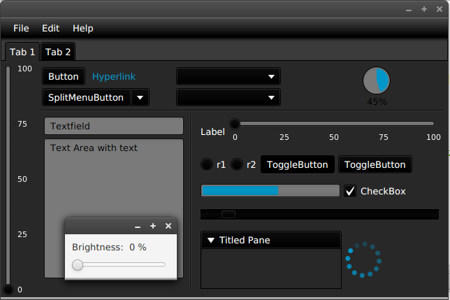
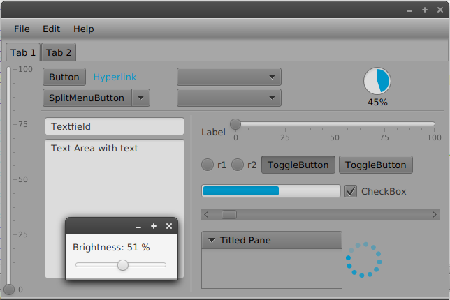
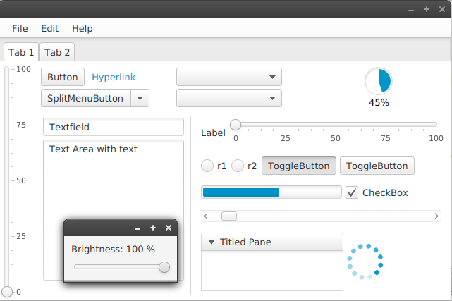

# JavaFX Brightness Example

This example shows how you can dynamically control the brightness of your application with
a style binding. In the example I used a slider to set the brightness.


```java
Parent root = ...

StringExpression styleString =
    Bindings.format("-fx-base:rgb(%1$.0f , %1$.0f, %1$.0f)", brightness.multiply(2.55));

root.styleProperty().bind(styleString);

```

## Run the example

To run the example you need an installed JDK in version 8.

```
cd src
javac App.java
java App
```


### Dark:



### Medium:



### Light:


